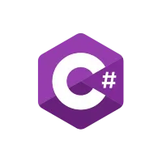

# cse210-ww-student-template

This is the starter code for students in the worldwide content version of CSE 210.

This repository contains the starter code for many different projects. They are arranged as follows:

- `sandbox` - An empty project that you can use to play around with any concepts you like.
- `csharp-prep` - Starter projects for each of the C# Prep assignments.
- `prepare` - Starter projects for each of the preparation Learning Activities.
- `prove` - Starter projects for each of the prove Developer projects.
- `final` - Starter projects for final project.

---

This course is a 14 weeks semester course crunched to 7 weeks. This means every week, it's double the workload. Some programming languages are multi-paradigm, this means you can write your codes/programs in a Procedual way (line by line), Functional way (with functions), or with Objects (Classes/OOP). C# focuses more on Object Oriented Programming - OOP. And this course introduces the notion of classes and objects. Presenting the four core mechanics/principles of OOP - Abstraction, Encapsulation, Inheritance, and Polymorphism.

---

The course is structured this way - per week ↓  
| Learning Activity 🎯| Teach One Another 👨🏾‍🏫| Team Design 👨🏾‍🎨| Prove/Develop 👨🏾‍💻|
| :--------: | :--------: | :--------: | :--------: |

---

#### The course outcome is as follows:

- `Articulate` the principles of programming with classes.
- `Design` software using these principles of programming with classes.
- `Develop` working software using the techniques of programming with classes.

---
